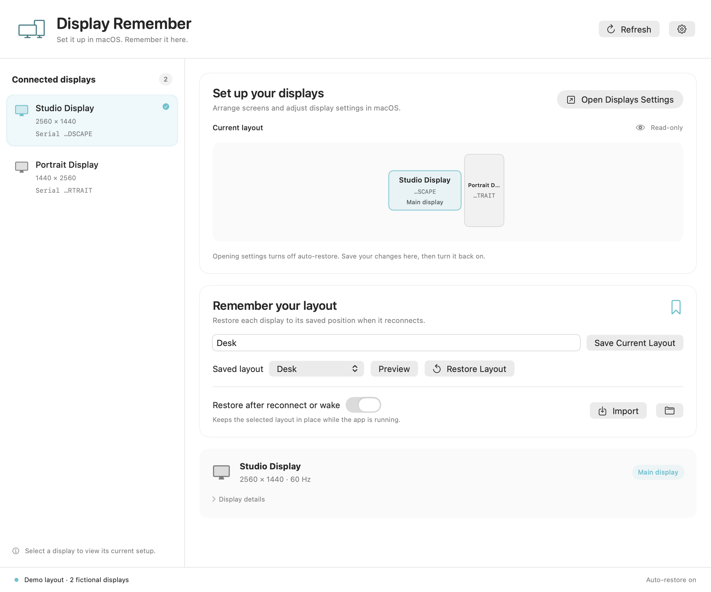

# Display Remember

Remember physical monitors and restore their saved layout after reconnection or wake.

Arrange your displays in macOS System Settings, then save the result in Display Remember. The app identifies monitors using EDID-derived metadata instead of relying on the current display ID or port order.



The screenshot uses fictional display data.

## Install

Available for **Apple Silicon and macOS 13 or later**.

```sh
brew install --cask d0lim/tap/display-remember
```

You can also download the app from [Releases](https://github.com/d0lim/display-remember/releases). Check the release notes for the artifact's signing and notarization status.

Homebrew is an installation option, not a runtime dependency. The app bundles its CLI and the complete displayplacer engine; it does not require Python or a separate displayplacer installation.

## Use

1. Open Display Remember and choose **Open Displays Settings**. This turns off automatic restoration before opening the macOS Displays panel.
2. Set the resolution, arrangement, rotation, and mirroring in System Settings.
3. Return to the app, check the current layout, and save it with a name.
4. Select a saved layout to preview or restore it. Optionally enable automatic restoration while the app is running.
5. Open **Settings…** (`⌘,`) to choose a language, show or hide the Dock icon, change the check interval, or enable **Launch at login**.

Monitor settings and the layout diagram in the app are read-only. Restoring a saved layout changes the display configuration. Automatic restoration is off by default; turn it off before changing your layout, then save the new layout before enabling it again.

The app remembers your selected profile and automatic restoration choice across launches. If the selected profile disappears, automatic restoration is disabled; another profile is never silently used in its place. Closing the main window keeps the app running in the menu bar. Quitting stops monitoring.

### App settings

- **Language:** follow the system language, use English, or use Korean (한국어). Changes appear immediately. Other system languages fall back to English. CLI output and technical diagnostics remain in English.
- **Hide Dock icon:** on by default. The app stays available in the menu bar, including while its main window is open. Changes apply immediately and persist across launches; turn this off to show the Dock icon.
- **Launch at login:** off by default. When enabled, the app starts in the menu bar after you log in, without opening its main window. macOS manages the login item; if approval is needed, Settings links to the system Login Items panel.
- **Check interval:** 2, 5, 10, 30, or 60 seconds; the default is 5. Polling runs only while automatic restoration is enabled. Wake and display-change events also refresh the inventory. Restoration waits for two stable polling observations and keeps a 30-second cooldown between attempts, so the interval is not a guaranteed restoration deadline.

App preferences are separate from display configuration, which remains in macOS System Settings. Opening **Displays Settings** also saves automatic restoration as off until you explicitly enable it again. The standalone CLI `watch` command keeps its own five-second interval.

Settings previews: [English](docs/images/settings.png) · [한국어](docs/images/settings-ko.png). These previews use fictional data and do not register login items.

Profiles are stored in `~/Library/Application Support/display-remember/Profiles`. Existing files are not overwritten. Import a JSON profile in the app, or copy files from this folder to back up or share a layout.

## CLI

The app includes a command-line interface:

```sh
CLI="/Applications/Display Remember.app/Contents/MacOS/display-remember"

"$CLI" scan
"$CLI" save desk.json --name Desk
"$CLI" apply desk.json                 # Preview only
"$CLI" apply desk.json --execute       # Restore and verify
"$CLI" watch desk.json --execute       # Restore after the display state settles
```

`scan` includes monitor serials and other hardware identifiers. Redact them before sharing its output or a saved profile.

The `displayplacer` subcommand passes arguments directly to the full bundled upstream engine:

```sh
"$CLI" displayplacer list
"$CLI" displayplacer --help
"$CLI" displayplacer list --v1.3.0

# Example ID only: replace 42 with an ID from your own list output.
"$CLI" displayplacer "id:42 res:1920x1080 hz:60 scaling:off origin:(0,0) degree:0"
```

Raw displayplacer configuration commands apply immediately without `--execute`. They retain upstream UUID, contextual ID, numeric serial, mode selection, mirroring, enable/disable, and other options. EDID matching belongs to saved profiles; it is not added to raw commands. See the [engine notes](Vendor/displayplacer/README.md).

## Matching and compatibility

- Profiles match manufacturer and product identifiers with a usable text serial, numeric serial, or validated EDID hash. A unique built-in display can use a built-in fallback.
- Every saved display must have exactly one match. Missing, additional, or ambiguous displays prevent automatic restoration; identical metadata cannot identify two otherwise indistinguishable monitors.
- CoreDisplay and the bundled engine use private macOS APIs. OS updates can affect compatibility. Intel Macs, DisplayLink, KVMs, and different docks need separate hardware validation.
- Available modes and disabled-display behavior depend on macOS and the hardware. If a disabled display disappears from the OS inventory, restoration waits for it to return.
- Applying a layout involves multiple system calls and can partially succeed. There is no automatic rollback.

## Build and test

Use Xcode or compatible Swift tools with a macOS SDK. There are no external Swift package dependencies.

```sh
scripts/build-engine.sh
swift test --build-system native
scripts/build-app.sh
```

The build creates `dist/Display Remember.app` and a ZIP archive. Use `scripts/build-app.sh debug` for a debug build. Signing and notarization for published artifacts are separate release steps; local builds should not be assumed notarized.

```text
Sources/DisplayRememberApp/      SwiftUI app, menu bar, and restoration scheduling
Sources/DisplayRememberAppSupport/ Preferences, login items, and English/Korean resources
Sources/DisplayRememberCLI/      Command-line interface
Sources/DisplayRememberCore/     Native scanner, profiles, matching, and engine wrapper
Tests/DisplayRememberCoreTests/  Fixture and process tests
Tests/DisplayRememberAppTests/   Profile selection and startup behavior tests
Tests/DisplayRememberAppSupportTests/ Preferences and translation tests
Vendor/displayplacer/            Pinned upstream C/Objective-C engine and license
Assets/                         App icon source
scripts/                        Build and packaging tools
```

See [CONTRIBUTING.md](CONTRIBUTING.md) for hardware checks and privacy guidance, and [SECURITY.md](SECURITY.md) for vulnerability reporting.

Maintainers can follow [the release guide](docs/RELEASING.md) for signing, packaging, and updating the Homebrew cask.

## License

[MIT](LICENSE), copyright 2026 display-remember contributors. The bundled displayplacer engine retains its [upstream MIT license](Vendor/displayplacer/LICENSE) and copyright notice. The app icon is an AI-generated minimal glyph; see [asset notes](Assets/README.md).
